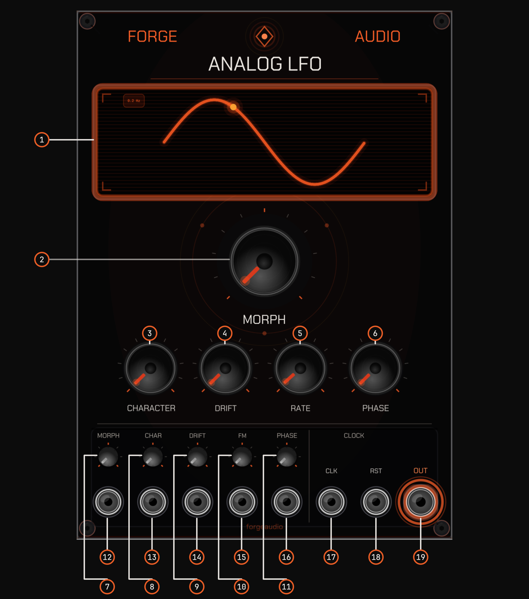

# Annotated Panel

Numbered callouts are baked into the panel image above. Each number keys 1:1 to a row in the legend below. This legend doubles as the control-reference table — ranges and behaviors are transcribed from the module source.

| # | Control | Type | Range / Behavior |
|---|---------|------|------------------|
| 1 | Display | Readout | Waveform preview + phase dot; shows Hz readout free-running, or ratio label + BPM + SYNC badge (and swing overlay) when clocked |
| 2 | Morph | Knob | Waveform-shape sweep: sine → triangle → saw → square → narrow pulse, roughly 20% each. Default fully down (sine) |
| 3 | Character | Knob | Sweeps from clean to analog character (warm triangle, vintage saw, classic square). Subtle at low settings, aggressive high. Default fully down |
| 4 | Drift | Knob | Adds analog imperfections: slow pitch wander, timing jitter, output-offset drift, and frequency lag. Eased back in clocked mode. Default fully down |
| 5 | Rate | Knob | Free-running: 0.01–20 Hz. Clocked: snaps to one of 15 musical ratios of the clock |
| 6 | Phase Offset | Knob | 0–360°. Default fully down (0°) |
| 7 | Morph-CV trim | Trimpot (attenuator) | 0–100%, default 0%. Scales the Morph CV input |
| 8 | Character-CV trim | Trimpot (attenuator) | 0–100%, default 0%. Scales the Character CV input |
| 9 | Drift-CV trim | Trimpot (attenuator) | 0–100%, default 0%. Scales the Drift CV input |
| 10 | FM-Depth trim | Trimpot (attenuator) | 0–100%, default 0%. Scales the FM input depth |
| 11 | Phase-Offset-CV trim | Trimpot (attenuator) | 0–100%, default 0%. Scales the Phase Offset CV input |
| 12 | Morph-CV jack | Input | Bipolar ±5V; adds to the Morph knob, scaled by the Morph-CV trim |
| 13 | Character-CV jack | Input | Bipolar ±5V; adds to Character, scaled by the Character-CV trim |
| 14 | Drift-CV jack | Input | Bipolar ±5V; adds to Drift, scaled by the Drift-CV trim |
| 15 | FM jack | Input | Exponential FM; amount set by the FM-Depth trim |
| 16 | Phase-Offset-CV jack | Input | Bipolar ±5V → 0–360°, scaled by the Phase-Offset-CV trim. Active only when patched |
| 17 | CLK jack | Input | Clock in. Registers above 1.0V, re-arms below 0.1V; any 5V or 10V clock works |
| 18 | RESET jack | Input | Restarts the waveform at the beginning of its cycle (click-free) |
| 19 | OUTPUT jack | Output | Bipolar ±5V. Click-free on reset |
